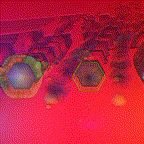
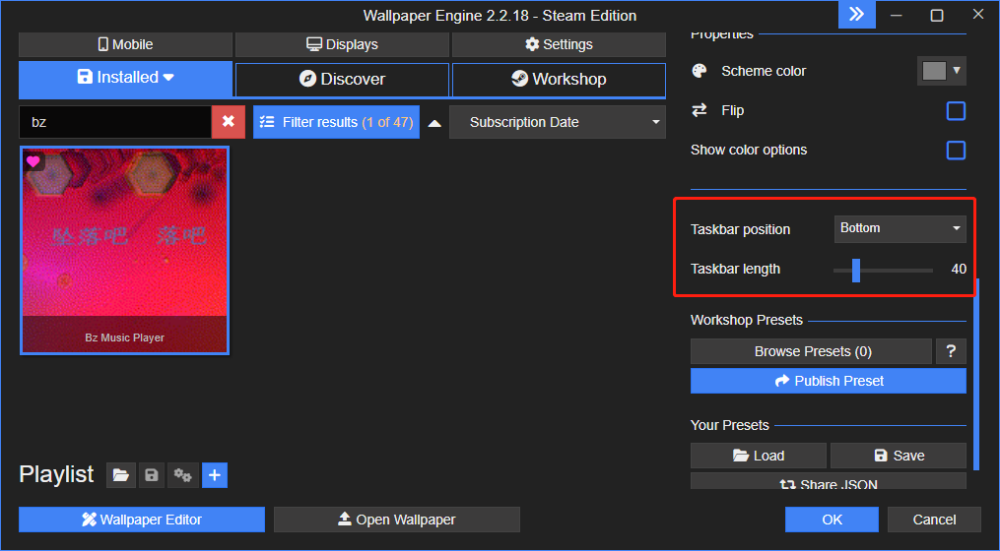

# Bz Music Player for Wallpaper Engine

Music player with Milk Drop Visualizer (published on Wallpaper Engine on Steam)

## Features

* Basic music player features
* Music Visualization using Milk Drop, and 3D lyrics text.
* You can import your own local music files (MP3 FLAC WAV) and lyrics files (LRC with UTF-8).
* Provided thousands of Milk Drop presets, and you can add them to your favorites.
* You can set the lyrics to your favorite color, and you can choose your own local font file.

## Gestures

* Swipe Left/Up: next preset
* Swipe Down/Right: prev preset
* Long Press: star/unstar current preset

## Attention
* Due to CEF limitations, the customization files (songs, lyrics, fonts) you chose will be lost the next time you switch to this wallpaper item, and you will need to choose them again.
* We can't automatically adjust the position and size of the view based on the position and width of the taskbar, so that some UI components are obscured by the taskbar, so you can adjust the native properties to tell the program how to display correctly.

## Thanks
* [jberg](https://github.com/jberg) for creating [Butterchurn](https://github.com/jberg/butterchurn)
* [Ryan Geiss](http://www.geisswerks.com/) for creating [MilkDrop](http://www.geisswerks.com/about_milkdrop.html)

## Links
* [Steam Workshop](https://steamcommunity.com/sharedfiles/filedetails/?id=2941147253)
* [GitHub](https://github.com/Benzolamps/bz-music-we)
* [Gitee](https://gitee.com/Benzolamps/bz-music-we)
